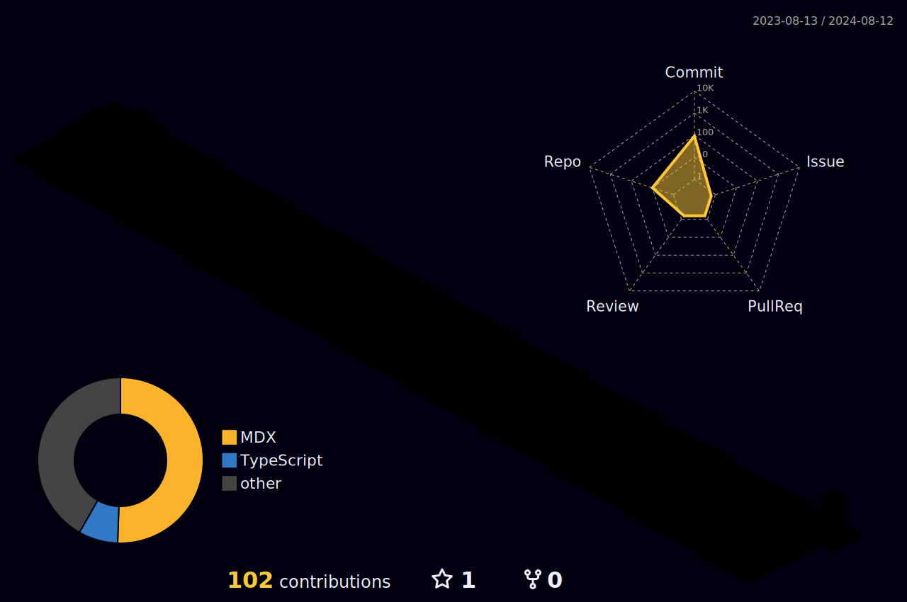

<h1 align="center">
  Hello
  
  , I'm Noah Sim.
</h1>

  
  

 

 

<h2>👨 About me:</h2>
<ul align="left">
  <li>🕸 Senior Frontend Developer - Next.js, React </li>
  <li>🕸 Senior Backend Developer - Node.js, PHP, Laravel, Wordpress, Rust </li>
  <li>💰 Junior Blockchain Developer - Smart Contract, Solana</li>
  <li>🔗 noahsim222@gmail.com</li>
</ul>

  
  
  
  

  

<h2>🏆 GitHub Trophies</h2>

  
  

