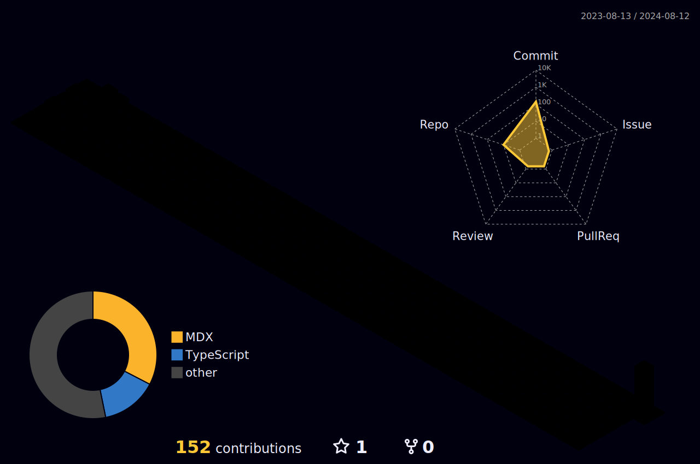

<h1 align="center">
  Hello
  
  , I'm Noah Sim.
</h1>

  
  

 

 

<h2>👨 About me:</h2>
<ul align="left">
  <li>🕸 Senior Fullstack Developer</li>
  <li>💰 Junior Blockchain Developer</li>
  <li>⏳ 5+ years of development experience</li>
</ul>

<h2>💌 Contact me:</h2>

  
  
  
  

<h2>💻 Languages and Tools:</h2>

  
  
  
  
   
  
  
  
   
   
  
  
  
   
  
   
    
   
   
   
  
   
  
  
  
  
  
   
  
  
  
  
   
  
   
  
  
  
  
  
   
  
  
  
  
  
  

<h2>🏆 GitHub Trophies</h2>

  
  

<h2>📊 GitHub Stats:</h2>

  <!--  -->
  
  
  
  
  <!--  -->
  <!--  -->
  
  
  

