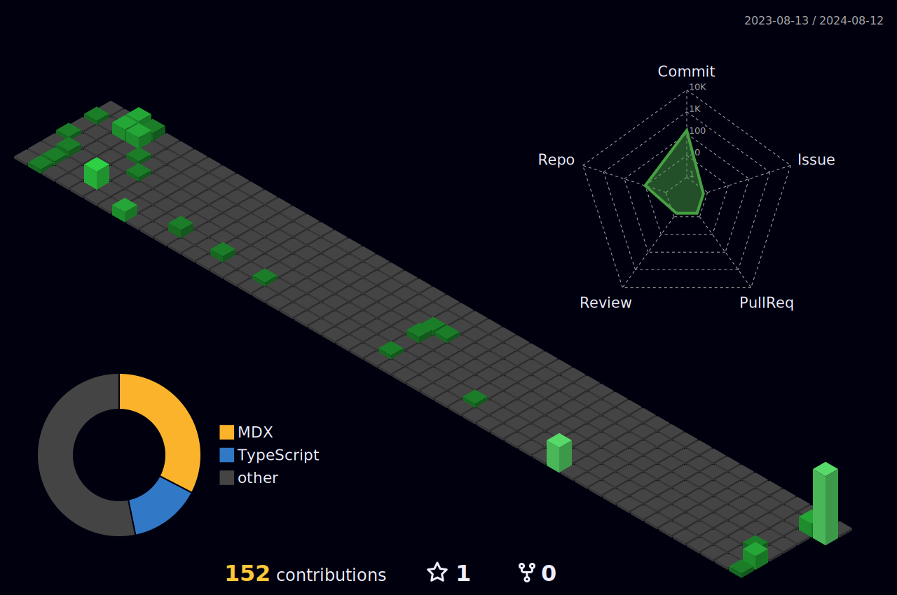

<h3 align="left">Languages and Tools:</h3>

                          

<picture>
  
</picture>

  

<!--  -->

### ✍️ Random Dev Quote

  
  

<h1 align="center">
  Hello
  
  , I'm Noah Sim.
</h1>
<h3 align="center">Senior Fullstack Developer</h3>
 

# 👨 About me:

- 🕸 Senior Fullstack Developer

- 💰 Junior Blockchain Developer

- ⏳ 5+ years of remote job experience

- 📫 How to touch me **noahsim222@gmail.com**
<h1 align="left">Contact me:</h1>

  
  
  

# 💻 Languages and Tools:

  

 
     
    
    
     
    
    
    
     
     
     
     
     
     
     
     
     
     
     
    
    
    
     
     
    

  

# 💗 My Favorites Techs:

# 📊 GitHub Stats:

  

# 🏆 GitHub Trophies

